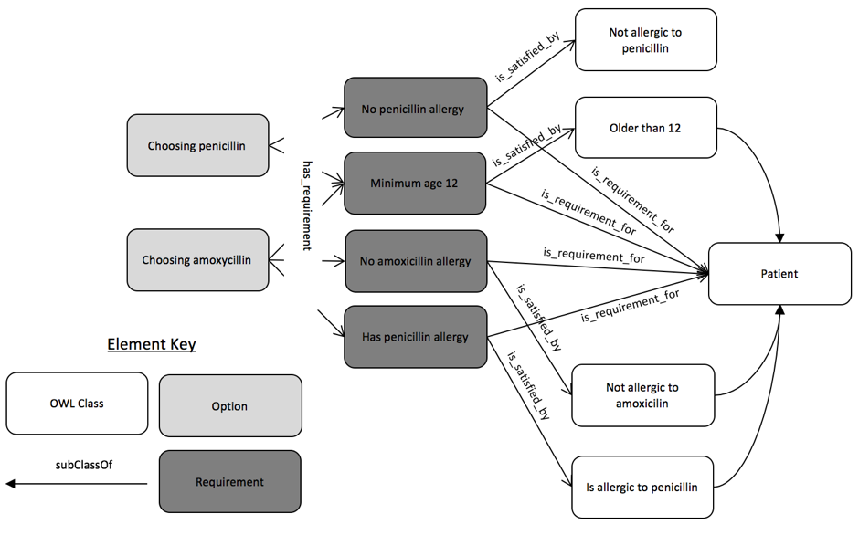

# Example: Bacterial throat infection
The example decision-making process is initiated by following problem/question: **What is the appropriate therapy for a
bacterial throat infection?** It covers the following scenario:

STAGE 1.  
A patient is diagnosed with a bacterial throat infection. The doctor needs to decide what treatment would be most
appropriate. In order to prescribe the right drug he/she has to know whether or not the patient has an allergy for the
drugs being considered for prescription and some parameters to evaluate correct dosing rules.

STAGE 2.  
Patient P1 returns with some symptoms of allergic reaction, which suggests that P1 has allergy for Penicillin. The
doctor decides to prescribe the other antibiotic.

In the [OWL file for this example](03.ttl), this type of process is represented by class labeled as **Deciding about
appropriate therapy for bacterial throat infection**.

  
A diagram of part of this example (not all Requirements are shown)  

```
Class: Deciding_about_appropriate_therapy_for_bacterial_throat_infection

Annotations:
    label "Deciding about appropriate therapy for bacterial throat infection"@en,
    comment "See 'Requirement_for_deciding_about_appropriate_therapy_for_bacterial_throat_infection' that defines necessary options and their criteria."@en

EquivalentTo:
    Decision_making
    and (is_initiated_by some Question_for_indicating_appropriate_therapy_for_bacterial_throat_infection)

SubClassOf:
    Decision_making
```

Let’s suppose our expert has a recommendation regarding the choice of possible options and their associated criteria for
this particular case. These fact has been represented in our knowledge base by adding Recommendation for deciding about
appropriate therapy for bacterial throat infection indicating what kind of decision-making it applies to and how it can
be satisfied.

```
Class: Recommendation_for_deciding_about_appropriate_therapy_for_bacterial_throat_infection

Annotations:
    label "Recommendation for deciding about appropriate therapy for bacterial throat infection"@en

    EquivalentTo:
        (is_recommendation_for some Deciding_about_appropriate_therapy_for_bacterial_throat_infection)
        and (is_satisfied_by only Recommended_decision_making_about_appropriate_therapy_for_bacterial_throat_infection_1)

    SubClassOf: Recommendation
```

It seems to be a good practice to add a distinct OWL class for every domain object (or other relevant entity) - that is
why another class labeled as Recommended decision making about appropriate therapy for bacterial throat infection 1 has
been introduced to our example indicating options recommended to be considered during this decision. Optionally a set of
additional questions related to options’ criteria can be explicitly added to a the decision-making description (as in
the following example):

```
Class: Recommended_decision_making_about_appropriate_therapy_for_bacterial_throat_infection_1

Annotations:
    label "Recommended decision making about appropriate therapy for bacterial throat infection 1"@en

    EquivalentTo:
        Deciding_about_appropriate_therapy_for_bacterial_throat_infection
        and (initiates some Question_for_confirming_of_being_older_than_12)
        and (initiates some Question_for_confirming_of_not_having_amoxicilin_allergy)
        and (initiates some Question_for_confirming_of_not_having_penicilin_allergy)
        and (initiates some Question_for_confirming_the_readiness_to_stay_home_for_five_days)
        and (is_consideration_of some Choosing_amoxicilin_therapy)
        and (is_consideration_of some Choosing_non_atibiotic_therapy)
        and (is_consideration_of some Choosing_penicilin_therapy),
        satisfies_recommendation some Recommendation_for_deciding_about_appropriate_therapy_for_bacterial_throat_infection

        SubClassOf:
            Deciding_about_appropriate_therapy_for_bacterial_throat_infection

```

Please note that every option and every underlying evaluation criteria is described by distinct OWL class (in [Protégé](http://protege.stanford.edu/)
they can be tracked by using the usage view).

```
Class: Choosing_penicilin_therapy

Annotations:
    label "Choosing penicilin therapy"@en

SubClassOf:
    Option,
    involves_choosing some Penicilin_therapy,
    has_criterion some Minimum_age_of_12_requirement,
    has_criterion some Requirement_for_not_having_penicilin_allergy
```

A decision (or other result of a decision-making process) can be specified by the **has_result** property.
